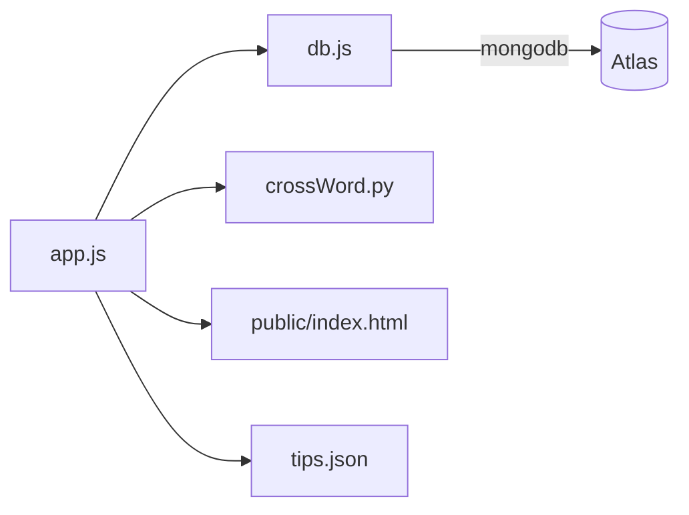

# Technical Specifications

This document describes the architecture, modules, tech stack, and deployment considerations for CrosswordNodeApp.

## High-level architecture

```mermaid
flowchart LR
  subgraph Client
    B[Web Browser]
  end

  subgraph Server[Node.js/Express]
    A[app.js\nExpress routes\nSessions, rate limit]
    D[db.js\nMongoDB access\nReset tokens]
    P[crossWord.py\nPython generator]
    Pub[public/\nindex.html + JS\nstyle.css]
  end

  subgraph Infra
    M[(MongoDB Atlas)]
    S[(SMTP Provider)]
  end

  B <--> Pub
  B -->|HTTP(S)| A
  A <--> D
  A -->|spawn/process| P
  D <--> M
  A --> S
```

- Browser loads `public/index.html`, which fetches puzzle data from the server and renders the grid.
- Server exposes routes for authentication, dashboard, puzzle data (`/data`), save/submit, export (`/export-history`), and the reset flow.
- Python script generates puzzle data on demand.
- MongoDB stores users, puzzle progress, history, reset tokens.
- SMTP provider is used to send password reset links.

## Deployment diagram

```mermaid
flowchart TB
  U[Users] -->|HTTPS| CDN[(Static CDN)]
  U -->|HTTPS| H[Hosting Platform\n(Render/Railway/Fly.io)]
  H -->|Node process| APP[CrosswordNodeApp]
  APP -->|SRV URI| ATLAS[(MongoDB Atlas Cluster)]
  APP -->|SMTP| MAIL[(Email Provider)]
```

- Static assets can be served by Express or an optional CDN.
- The application process runs on a Node host (Render, Railway, Fly, etc.).
- Database is MongoDB Atlas using the SRV connection string.
- Email provider (Mailtrap, Gmail, M365, SendGrid SMTP) is used for reset links.

## Optional package/module diagram



## Tech stack

- Runtime: Node.js 20+, Express 4
- Database: MongoDB (Atlas recommended)
- Auth/session: `express-session`
- Password hashing: `bcryptjs`
- Rate limiting: `express-rate-limit` (e.g., on forgot route)
- Email: `nodemailer` (conditional; app logs link when not configured)
- Export: `archiver` to build ZIP of history
- View/UI: server-served HTML (vanilla JS + CSS), no framework; fonts/shapes via CSS
- Puzzle generator: Python 3 (`crossWord.py`)

Exact versions are in `package.json`:
- express ^4.21.0
- express-session ^1.18.0
- express-rate-limit ^7.4.0
- mongodb ^6.9.0
- bcryptjs ^2.4.3
- archiver ^5.3.1
- ejs ^3.1.10 (available; the current UI is HTML+JS)

## Data model (high-level)

Users collection fields (conceptual):
- username: string (lowercase, unique)
- email: string
- passwordHash: string (bcrypt)
- passwordUpdatedAt: date
- currentPuzzleId: string|null
- currentPuzzleAnswers: string
- currentPuzzleElapsedTime: number (seconds)
- currentPuzzleWrongAttempts: number
- completedPuzzles: [puzzleId]
- completedHistory: [{ puzzleId, completedAt, elapsedTime }]

Password reset tokens collection (conceptual):
- username, email
- tokenHash (SHA-256)
- createdAt, expiresAt, consumedAt
- type: 'link-reset'

Password reset requests (for admin visibility):
- username, email, userAgent, ip, createdAt, resolvedAt

## Key routes (non-exhaustive)
- `GET /` – dashboard (auth required)
- `GET /login`, `POST /login`, `GET /logout`
- `GET /register`, `POST /register`
- `GET /forgot`, `POST /forgot` (strict match: send link only if username+email match)
- `GET /reset?token=...`, `POST /reset`
- `GET /data` – puzzle payload (grid, legend, saved answers, elapsed time)
- `POST /save-progress` – persist current answers and elapsed time
- `POST /submit-score` – record completion or wrong attempt
- `GET /export-history` – zip of user’s completed/failed, progress snapshot
- `GET /health` – health/diagnostics

## Security notes
- Passwords stored with bcrypt hashes.
- Reset tokens stored hashed with SHA-256; single-use; default expiry ~15 minutes.
- Forgot endpoint rate-limited; generic messaging avoids user enumeration.
- Sessions stored server-side; set `SESSION_SECRET` in env.

## Environment variables
- `MONGO_URI`, `MONGO_DB`
- `SESSION_SECRET`, `PORT`
- `APP_BASE_URL` (used in reset links)
- `SMTP_HOST`, `SMTP_PORT`, `SMTP_USER`, `SMTP_PASS`, `SMTP_FROM`
- `ADMIN_USERS` (optional)
- `ALLOW_MEMORY_FALLBACK` (dev only)

## Build & run
- Local dev with fallback: set `ALLOW_MEMORY_FALLBACK=true`, then `npm start`.
- With MongoDB: set `MONGO_URI`, `MONGO_DB`, and seed once via `npm run seed`.

## Deployment notes
- Ensure `APP_BASE_URL` matches the public URL so links are correct.
- Do not set `ALLOW_MEMORY_FALLBACK` in production.
- Prefer Atlas SRV connection string; restrict IPs; use strong DB user credentials.
- Add SPF/DKIM for production sender domain if applicable.
